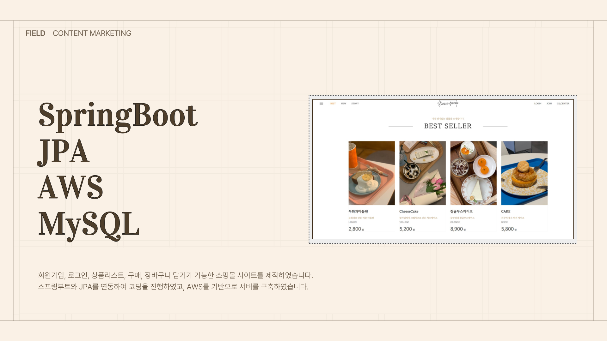

# Shop_Project_SpringBoot

<h1><a href="http://13.209.250.149/">🎈 프로젝트 보러 가기 🎈</a></h1>
 
<h2>
  Shopping mall Project with SpringBoot   
  (스프링부트 쇼핑몰 프로젝트 with JPA)
</h2>

  <h3>- TOOL -</h3>
  
   
  
  <h3>- FRONTEND -</h3>
  
   
	 
	 
  
   
  <h3>- BACKEND -</h3>
  
  
   
  <h3>- SERVER -</h3>
  
  
  
  
 
  

 

  
  
  

